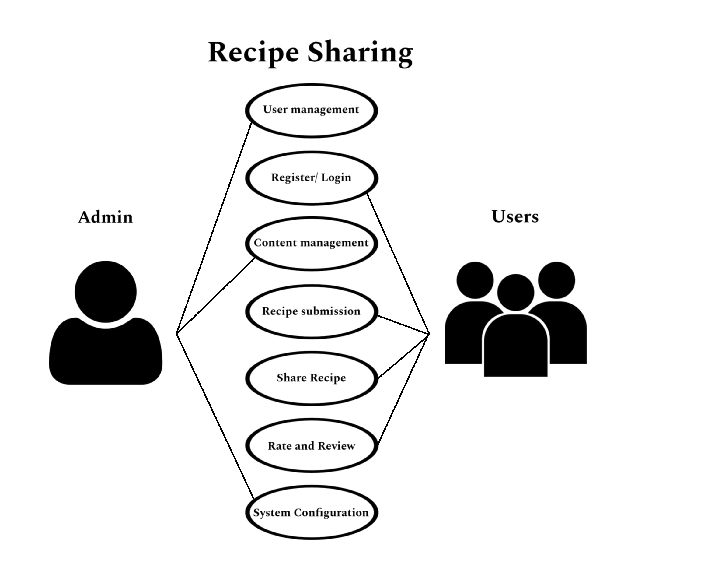

## Recipe Sharing Platform (Chef Savvy)

### INTRODUCTION 

Chef Savvy is an online recipe-sharing platform designed to support local cooks. This platform aims to empower cafeteria owners, small-scale cooks, and aspiring chefs by providing them with a diverse collection of budget-friendly recipes tailored to local tastes and preferences. Chef Savvy will serve as a daily guide, helping cooks curate their menus and offer delicious, cost-effective meals that appeal to their customers.
Along with providing simple access to affordable recipe ideas, local cooks of Camarin may share their own recipes, trade advice, and improve their culinary abilities in a collaborative setting created by Chef Savvy.

### Target Audience:

Both large and small cafeteria owners looking for affordable meal ideas to serve their customers.

### PROJECT FEATURES AND CHARACTERISTICS 

-Recipe submission
-User profiles
-Search and Filtering
-Recipe Collections 
-Rating and reviews 
-Community Forums

### Project Scope

This project is targeted towards both large and small cafeteria owners who are seeking cost-effective meal ideas to better serve their customers. The system will be developed using Angular to ensure a robust, scalable, and user-friendly platform that meets the needs of cafeteria operators of all sizes.

## Work breakdown Structure

## Functional Requirements

| User Role | System Features | Requirements |
| -------- | -------- | -------- |
|Admin| Manages platform, moderates content, oversees system performance.	| Manages platform, moderates content, oversees system performance.	    |
|Cafeteria Owners|  Create daily menus, access budget-friendly recipes, and generate shopping lists.     |      Menu generation, recipe search and filtering, shopping list creation, and budget calculator.   |
|Local cooks|    Browse and contribute recipes, save favorites, leave reviews and ratings.   |     Recipe creation and submission, favorite recipes, recipe ratings and reviews, notifications system.     |
|Aspiring Chefs | Experiment with new recipes, refine culinary skills, track recipe popularity.   | Recipe analytics, sharing functionality, ability to categorize recipes, and in-app messaging.  |
|General Users | Browse, save, and share recipes, review and rate them, follow other cooks. |Search/filter recipes, recipe sharing on social media, user reviews, and rating capabilities.  |

## Use Cases

## Database Architecture

## Data Dictionary
## ERD
