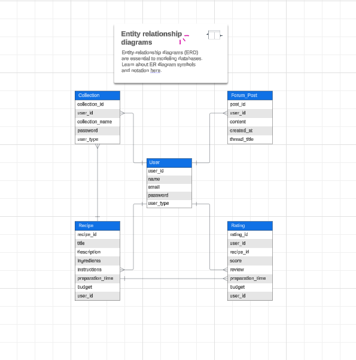

# Recipe Sharing Platform (Chef Savvy)

## Introduction

Chef Savvy is an online recipe-sharing platform designed to support local cooks. This platform aims to empower cafeteria owners, small-scale cooks, and aspiring chefs by providing them with a diverse collection of budget-friendly recipes tailored to local tastes and preferences. Chef Savvy will serve as a daily guide, helping cooks curate their menus and offer delicious, cost-effective meals that appeal to their customers.
Along with providing simple access to affordable recipe ideas, local cooks of Camarin may share their own recipes, trade advice, and improve their culinary abilities in a collaborative setting created by Chef Savvy.

## Target Audience:

Both large and small cafeteria owners looking for affordable meal ideas to serve their customers.

## Project features and Characteristics

##### Recipe submission
* Users can upload and share their recipes with others on the platform.
* Recipe submissions include ingredients, cooking instructions, serving sizes, and optional media (photos, videos).
##### User profiles
* Users create profiles where they can manage their submissions, favorite recipes, and view their ratings and reviews.
##### Search and Filtering
* Users can search for recipes based on various filters such as ingredients, cuisine type, budget range, preparation time, and more.
##### Recipe Collections
* Users can create collections of favorite recipes or save recipes to themed collections (e.g., vegetarian, low-budget meals, regional cuisine).
##### Rating and reviews
* Users can rate and review recipes, providing feedback to the community and helping others make informed choices.
##### Community Forums
* A section for users to discuss tips, share ideas, ask questions, and engage with the broader cooking community.

## Project Scope

This project is targeted towards both large and small cafeteria owners who are seeking cost-effective meal ideas to better serve their customers. The system will be developed using Angular to ensure a robust, scalable, and user-friendly platform that meets the needs of cafeteria operators of all sizes.

## Work breakdown Structure

 

## Functional Requirements

| User Role | System Features | Requirements |
| -------- | -------- | -------- |
|Admin| Manages platform, moderates content, oversees system performance.	| Manages platform, moderates content, oversees system performance.	    |
|Cafeteria Owners|  Create daily menus, access budget-friendly recipes, and generate shopping lists.     |      Menu generation, recipe search and filtering, shopping list creation, and budget calculator.   |
|Local cooks|    Browse and contribute recipes, save favorites, leave reviews and ratings.   |     Recipe creation and submission, favorite recipes, recipe ratings and reviews, notifications system.     |
|Aspiring Chefs | Experiment with new recipes, refine culinary skills, track recipe popularity.   | Recipe analytics, sharing functionality, ability to categorize recipes, and in-app messaging.  |
|General Users | Browse, save, and share recipes, review and rate them, follow other cooks. |Search/filter recipes, recipe sharing on social media, user reviews, and rating capabilities.  |

## Use Cases

## Data Dictionary for Chef Savvy
A data dictionary for Chef Savvy serves as a comprehensive guide to the data elements used in the system, defining each element, its type, constraints, and relationships. Here's a structured data dictionary for the platform:

| **Field Name**            | **Description**                                                                     | **Data Type** | **Length**   | **Sample**                    |
|---------------------------|-------------------------------------------------------------------------------------|----------------|--------------|-------------------------------|
| **UserID**                | Unique identifier for each user.                                                   | Integer        | N/A          | `1`                           |
| **Username**              | The name chosen by the user for account identification.                             | String         | 3-15         | `john_doe`                   |
| **Password**              | User's password for account security.                                               | String         | 8-20         | `p@ssW0rd123`                |
| **Email**                 | User's email address for communication and account recovery.                        | String         | 50           | `john@example.com`           |
| **Role**                  | The role of the user in the system (Admin, Cafeteria Owner, Local Cook, etc.).    | Enum           | N/A          | `Cafeteria Owner`            |
| **RecipeID**              | Unique identifier for each recipe.                                                 | Integer        | N/A          | `1`                           |
| **Title**                 | The title of the recipe.                                                            | String         | 1-100        | `Spaghetti Carbonara`        |
| **Ingredients**           | List of ingredients required for the recipe.                                       | Text           | N/A          | `Pasta, Eggs, Cheese`        |
| **Steps**                 | Step-by-step instructions for preparing the recipe.                                | Text           | N/A          | `Boil water, Cook pasta...`  |
| **PreparationTime**       | Time required to prepare the dish.                                                 | Integer        | N/A          | `30`                          |
| **CookingTime**           | Time required to cook the dish.                                                    | Integer        | N/A          | `15`                          |
| **TotalCost**             | Estimated cost of the ingredients for the recipe.                                  | Decimal        | N/A          | `5.50`                       |
| **Rating**                | User's rating for a recipe (1-5 scale).                                           | Integer        | 1            | `4`                           |
| **Review**                | User's review text for a recipe.                                                  | Text           | 0-500        | `Delicious and easy to make!`|
| **Favorites**             | List of recipes saved by a user as favorites.                                     | Object         | N/A          | `{userId: 1, recipeIds: [1, 2]}` |
| **ShoppingList**          | Represents a list of ingredients needed for selected recipes.                      | Object         | N/A          | `{userId: 1, items: ['Pasta', 'Eggs']}` |
| **NotificationID**        | Unique identifier for each notification.                                           | Integer        | N/A          | `1`                           |
| **NotificationMessage**   | Notification content sent to users about new recipes or updates.                   | String         | 0-250        | `New recipe added!`          |
| **CreatedAt**             | Timestamp for when the user or recipe was created.                                 | DateTime       | N/A          | `2024-10-04 10:00:00`        |
| **UpdatedAt**             | Timestamp for when the user or recipe was last updated.                           | DateTime       | N/A          | `2024-10-04 12:00:00`        |

  
## ERD

